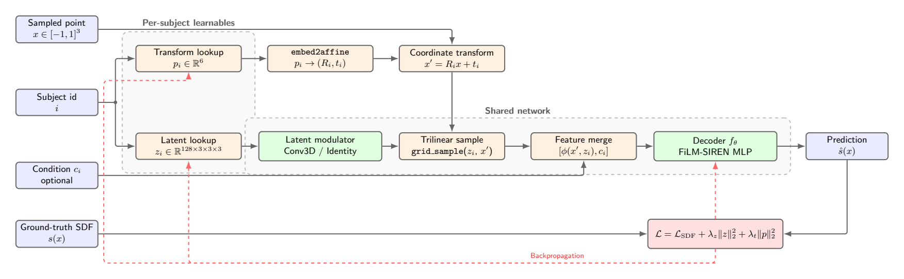
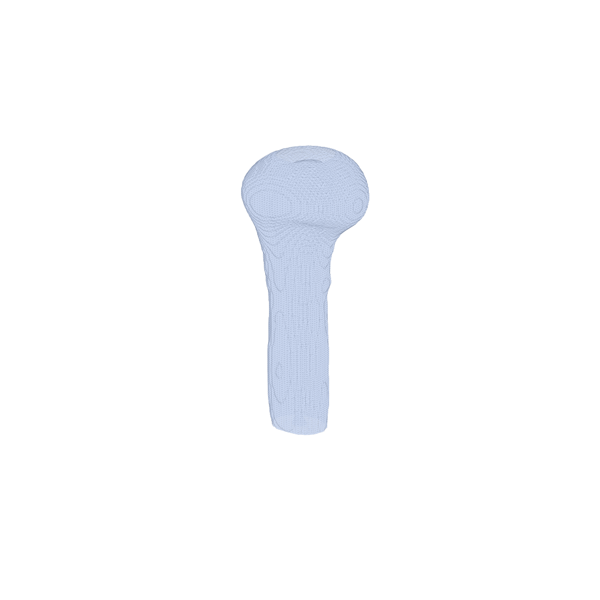

# Humerus Atlas with Implicit Neural Representations

This repository builds a 3D statistical representation of proximal humerus anatomy from fractured and ground-truth STL meshes.

The goal is to learn a continuous Signed Distance Function (SDF) atlas that:

- reconstructs subject-specific bone geometry,
- aligns subjects into a common canonical space,
- supports fracture-density analysis and CAD export,
- provides quantitative atlas quality evaluation.

## Problem We Are Solving

Clinical humerus fracture datasets are often available as fragmented meshes (multiple STL pieces per subject), with strong shape variation and inconsistent orientation.

We want one unified model that can:

1. absorb all these fragmented observations,
2. represent geometry continuously in 3D,
3. recover a mean anatomical atlas,
4. measure how well this atlas matches observed subjects,
5. identify high-risk fracture zones on top of the atlas.

## High-Level Pipeline

1. Data discovery and voxelization
- `data_loading/prepare_data.py` discovers subject folders (`patient_*`, `GT *`, `template_control`).
- Fragmented STL pieces are merged per subject.
- Each subject mesh is converted into a normalized SDF volume (`*_sdf.npy`).
- Metadata TSV and train/val subject-id YAML are generated.

2. SDF sampling for training
- `data_loading/dataset.py` loads preprocessed SDF volumes.
- It samples training points using a hybrid strategy:
  - near-surface sampling around the zero level-set,
  - uniform global sampling in `[-1, 1]^3`.

3. INR auto-decoder model
- `models/inr_decoder.py` defines `BoneINRDecoder`.
- Each subject has learnable latent volume embeddings and learnable rigid transform parameters.
- Rigid transforms are applied via axis-angle + translation (`embed2affine`).
- Coordinates query latent volumes through trilinear interpolation (`grid_sample`).
- The final SDF is predicted by a FiLM-modulated SIREN MLP.

4. SIREN decoding
- `models/siren.py` implements sinusoidal representation layers.
- Optional latent modulation controls subject-specific geometry through FiLM-like scaling and bias.

5. Atlas evaluation
- `evals/evaluate_atlas_bridge.py` samples surface points from atlas and subjects.
- It reports symmetric Chamfer and HD95 distance metrics.
- Optional learned rigid transform correction can be applied from a checkpoint.

6. Fracture pattern analysis
- `fracture_atlas/fracture_analyzer.py` analyzes fracture-density maps on atlas space.
- It extracts high-density zones and exports STL outputs for visualization/CAD use.

## Model Architecture

The architecture diagram used in this project is shown below.



Original PDF: [image (1).pdf](image%20(1).pdf)

## Learned Atlas (Epoch 2999)

The atlas mesh used for evaluation in this project is:

- `output/bone_20260215_142952_loc/atlas/atlas_mesh_ep2999.stl`

Rendered view of the epoch-2999 atlas:



## Key Project Structure

- `configs/`: configuration files
- `data_loading/`: preprocessing and dataset code
- `models/`: INR decoder and SIREN network
- `evals/`: atlas evaluation scripts and outputs
- `fracture_atlas/`: fracture density and analysis tools
- `output/`: checkpoints, atlas exports, and run artifacts
- `tests/`: data-loading and pipeline tests

## Typical Evaluation Command

From project root:

```bash
python evals/evaluate_atlas_bridge.py \
  --atlas-mesh output/bone_20260215_142952_loc/atlas/atlas_mesh_ep2999.stl \
  --data-dir data \
  --subject-types gt \
  --canonicalize-side
```

## Notes

- Distances in evaluation are mesh-point distances (Chamfer, HD95).
- Data preprocessing and model training assume normalized coordinate space `[-1, 1]^3`.
- Epoch `2999` atlas is the primary reference artifact documented here.
